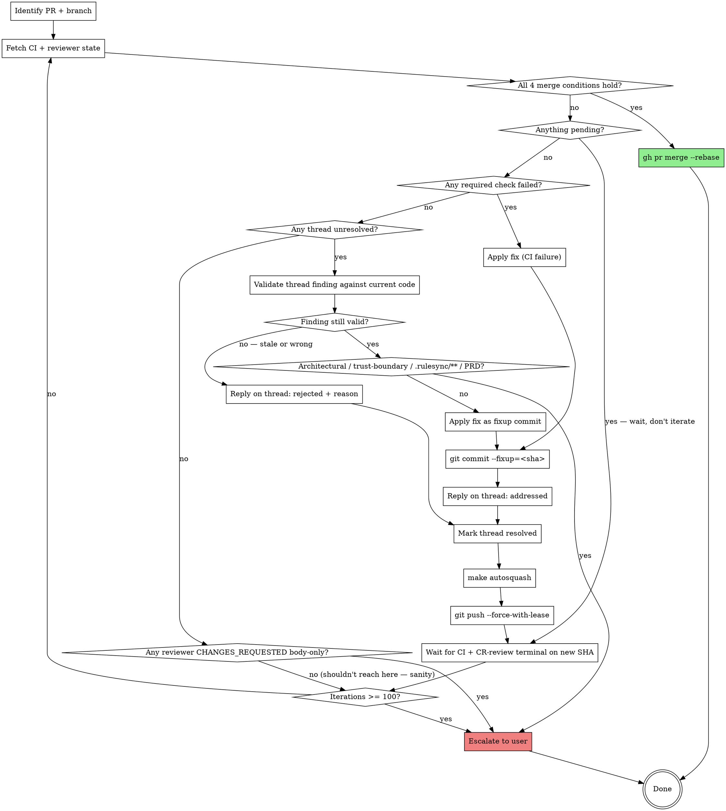

# AlfredOS path-to-green

A one-shot skill: invoke it on a PR, and it drives the PR to green and merges it. **Encodes the loop a contributor would otherwise run by hand.**

## Usage

```text
/path-to-green                # Drive the PR for the current branch
/path-to-green <PR-number>    # Drive a specific PR
```

## When to invoke

- After opening a PR and a multi-agent review has surfaced findings.
- When CI is red and you want the loop to converge.
- When CodeRabbit comments are accumulating and you want them addressed in one shot.
- At the end of a feature branch, when "make it green and merge it" is the only remaining step.

## When NOT to invoke

- The PR has unresolved architectural ambiguity. Use `/review-pr` first to surface it; address with the user.
- The PR touches `.rulesync/**` (the source of truth — `CLAUDE.md`, `AGENTS.md`, `.claude/`, etc. are gitignored generated artifacts) or `PRD.md` — those sources are human-gated; the skill MUST escalate any review comment that asks to modify them.
- The PR is in draft and you're still iterating on the design.
- You don't have the merge permission. Run the loop but stop short of `gh pr merge`.

## Hard caps and safety

- **Iteration safety stop (100) vs operational expectation (~5)**: the hard stop is **100 rounds** of fix-push-wait — purely an emergency brake against pathological divergence (same finding recurring, fix introduces two new findings, flake masking as a finding). The **expected operational convergence point is ~5 rounds**: CodeRabbit (and good human reviewers) genuinely find progressively smaller-but-still-real issues, but after ~5 rounds the residue should be trivial nits. If you cross ~5 and the iteration counts aren't dropping AND the severities aren't shrinking, pause and ask the user — that's the "something is structurally wrong" signal. If you cross 100, escalate hard with a per-iteration finding count + severity histogram so the user can see whether you were converging slowly (fine) or churning (not fine). See also the **Tips** section at the bottom.
- **No bypasses**: never `--no-verify`, never `LEFTHOOK=0`, never `gh pr merge --admin`. If a hook or required check is failing, fix the underlying issue.
- **Force-push only with `--force-with-lease`**: prevents clobbering pushes you didn't expect (e.g. CodeRabbit applies a fix via PR-edit while you're working).
- **Never propose merging before every reviewer's incremental review on the *current* SHA has reached a terminal state.** "CR review in progress" / "human reviewer requested" / "thread pending" is NOT a green light. The skill must NOT ask the operator "merge anyway?" — that's a force-merge in disguise. Wait for terminal state, then either merge automatically (Step 7) or iterate (back to Step 3) — those are the only two options.
- **Never offer "merge anyway" as a choice.** If the skill is not allowed to merge (per the rule above), it stays in the loop or escalates. The operator can override outside the skill (e.g. `gh pr merge` by hand) but the skill itself must not propose it.
- **Trust-boundary changes escalate**: any fix that touches `src/alfred/security/`, `src/alfred/audit/`, secret broker, capability gate, trust-tier, or audit-log writers — pause and surface to the user. Do not auto-apply.
- **`PRD.md` and `.rulesync/**` changes escalate**: those are the human-gated sources. (`CLAUDE.md`, `AGENTS.md`, `.claude/`, `.gemini/`, etc. are generated outputs — gitignored — so they shouldn't appear in a diff in the first place; if they do, that's a separate drift finding.)

## The loop



## Instructions

### Step 1: Resolve scope

```bash
PR="${ARGUMENTS:-}"
if [ -z "$PR" ]; then
  # Current-branch's PR
  PR=$(gh pr view --json number --jq .number 2>/dev/null) \
    || { echo "no PR for current branch"; exit 1; }
fi

# Pull PR metadata and assign every downstream variable in one shell-eval.
# Steps 2-7 below rely on $head_branch, $base, and $head_sha being set.
eval "$(gh pr view "$PR" --json headRefName,baseRefName,headRefOid,state \
  --jq '@sh "head_branch=\(.headRefName) base=\(.baseRefName) head_sha=\(.headRefOid) state=\(.state)"')"

if [ "$state" != "OPEN" ]; then
  echo "PR #$PR is not OPEN ($state) — nothing to drive" >&2
  exit 0
fi
echo "PR=#$PR head=$head_branch base=$base head_sha=${head_sha:0:7}"
```

### Step 2: Locate the worktree

The PR is on a feature branch. The contributor probably has a worktree at `$REPO-worktrees/<branch>`. Resolve and CAPTURE the path — Steps 5-8 need it:

```bash
worktree_path=$(git worktree list --porcelain \
  | awk -v b="refs/heads/$head_branch" '
      /^worktree / {wt=$2}
      /^branch / && $2==b {print wt; exit}
    ')
if [ -z "$worktree_path" ]; then
  echo "no worktree for $head_branch — refusing to proceed" >&2
  exit 1
fi
cd "$worktree_path"
```

All work happens **inside the worktree**, never on the main branch. Every `cd`-sensitive command below assumes `$PWD == $worktree_path`.

### Step 3: Fetch CI + reviewer state

First, derive owner+repo from the PR base — never hard-code, never use literal `<owner>/<repo>` placeholders:

```bash
repo_full=$(gh pr view "$PR" --json baseRepository --jq '.baseRepository.nameWithOwner')
owner="${repo_full%%/*}"
repo="${repo_full##*/}"
```

Then fetch:

```bash
# CI gates
gh pr checks "$PR" --required --json name,status,conclusion,workflowName,detailsUrl \
  > /tmp/path-to-green-$PR-checks.json

# Reviews (CodeRabbit + humans)
gh api "repos/$repo_full/pulls/$PR/reviews" \
  --jq '[.[] | {id, state, user: .user.login, submitted_at, body_head: (.body[0:200])}]' \
  > /tmp/path-to-green-$PR-reviews.json

# Inline comments
gh api "repos/$repo_full/pulls/$PR/comments" \
  --jq '[.[] | {id, in_reply_to_id, user: .user.login, path, line, body_head: (.body[0:300]), created_at}]' \
  > /tmp/path-to-green-$PR-comments.json

# Thread resolution status (CodeRabbit auto-resolves; humans usually don't)
gh api graphql \
  -f query='query($owner:String!,$repo:String!,$n:Int!){repository(owner:$owner,name:$repo){pullRequest(number:$n){reviewThreads(first:100){nodes{id isResolved comments(first:1){nodes{path body author{login}}}}}}}}' \
  -F n="$PR" -f owner="$owner" -f repo="$repo" \
  > /tmp/path-to-green-$PR-threads.json
```

### Step 4: Decide the loop body

#### Case A — every condition below holds → merge

ALL of these must be true on the **current head SHA** (the one you just pushed):

1. Every required-status check is `pass`.
2. Every review thread is `isResolved == true`.
3. Every reviewer's **latest** review state for the CURRENT SHA is `APPROVED` or `COMMENTED` — **never `PENDING`, never `CHANGES_REQUESTED`, never `DISMISSED`**. (A reviewer can leave a body-only `CHANGES_REQUESTED` review with no inline threads — that satisfies condition 2 but fails condition 3, and is a real block.) CodeRabbit `COMMENTED` after the loop's last fixup is the "I re-read your update and have no further actionable findings" signal.
4. No reviewer's CI run is still in progress for this SHA (the CodeRabbit status check reads `pass`, `fail`, or `skipped` — NEVER `pending`).

If any of these is false:

- **Condition 1 fails (required check still `pending`)** → **wait** (back to Step 3).
- **Condition 1 fails (required check `fail`)** → go to **Case B** (classify + remediate).
- **Condition 2 fails (thread unresolved)** → go to **Case C** (classify + remediate per-thread).
- **Condition 3 fails (`PENDING` review)** → **wait** — that reviewer is still working.
- **Condition 3 fails (`CHANGES_REQUESTED` body-only review with no inline threads)** → escalate to user. CR / a human is asking for something the loop can't pattern-match into a thread-level fix; surface their body text and the user decides.
- **Condition 3 fails (`DISMISSED`)** → **escalate to user**. A dismissed review is an explicit signal from a human (or admin) that something happened in the review flow the bot can't pattern-match — surface the dismissal text and the reviewer, let the operator confirm the path forward. This is intentionally the most conservative branch.
- **Condition 4 fails (CR check `pending`)** → **wait**.

Do not propose merge in any of these branches. Do not ask the operator "merge anyway?" — that's a force-merge in disguise and breaches this skill's core promise.

Proceed to **Step 7 (merge)** only when all four conditions above hold.

#### Case B — CI gate failed

For each failed gate, fetch the failure log via the `detailsUrl`. Classify:

- **Lint failure** (ruff): run `make fix` locally then `make check`. If clean, commit as `fixup` to the most recent commit that introduced the offending code.
- **Format failure**: run `make format-fix` (in our Makefile) then `make check`.
- **Type failure** (mypy / pyright): fix the type signature or add a justified `# type: ignore[<code>]  # reason: ...`.
- **Unit test failure**: read the test output, fix the code (not the test, unless the test is wrong).
- **Integration test failure**: same, but verify locally with Docker running.
- **Security scan failure** (gitleaks / zizmor / semgrep / trivy / CodeQL): NEVER suppress; fix the underlying issue. If gitleaks flags a value as a credential and it's a legitimate non-secret, replace with an emphatically-non-secret placeholder (e.g. `not-a-real-secret-bootstrap-placeholder`).
- **Commit-format failure**: re-author commit subjects (interactive rebase) to satisfy the gate's actual regex (`.github/workflows/pr-validate-commits.yml`), which today is `^[a-z]+(\([^)]+\))?(!)?: .*#[0-9]+.*$` — any lowercase type, optional scope, optional `!`, must contain `#<digits>` somewhere in the subject. The AlfredOS preferred form is stricter: pick a type from `build|chore|ci|docs|feat|fix|perf|refactor|revert|security|style|test` (matching CONTRIBUTING.md's allowed list) and put the issue ref in trailing `(#NNN)` parentheses. Both shapes pass.

#### Case C — reviewer comment (CodeRabbit or human)

For each unresolved thread:

1. **Validate the finding against the CURRENT code.** CodeRabbit's review SHAs may be stale. Read the file at the cited line; verify the issue still exists.
2. If invalid (already fixed, or based on a misreading), **post a reply** on the thread explaining the resolution + reference the commit SHA that addressed it. Mark the thread resolved.
3. If valid and **architectural / trust-boundary / `.rulesync/**`-touching / PRD-touching** → **escalate to user**. Quote the finding and the relevant code. Do not auto-apply.
4. If valid and mechanical → apply fix as `git commit --fixup=<sha>` where `<sha>` is the commit that introduced the issue. Reply on the thread linking the fixup commit. Mark resolved.

### Step 5: Commit hygiene

- Always `git commit --fixup=<sha>`. Never `git commit -m "fix: apply CR auto-fixes"`. Per the AlfredOS memory rule, that's an explicit anti-pattern.
- Group fixes by which commit they're fixing up. One fixup per logical concern.
- After all fixups for the iteration are made: `make autosquash` (runs `scripts/autosquash.sh`, tree-preserving, non-interactive).

### Step 6: Push + wait

```bash
git push --force-with-lease
# Refresh the HEAD SHA — we just rewrote it — then watch the run for that
# exact SHA. `gh run list --branch X --limit 1` can return an older run
# (race with GitHub's run registry) and make us act on stale status.
head_sha=$(git rev-parse HEAD)
run_id=""
for attempt in 1 2 3 4 5 6; do
  run_id=$(gh run list --branch "$head_branch" --limit 20 \
    --json databaseId,headSha \
    --jq "[.[] | select(.headSha == \"$head_sha\")] | .[0].databaseId" 2>/dev/null || true)
  if [ -n "$run_id" ] && [ "$run_id" != "null" ]; then
    break
  fi
  # GitHub's run registry is still catching up. Back off and retry.
  # Total worst case across 6 attempts: 2+4+8+16+32+64 = 126s.
  sleep $((2 ** attempt))
done
if [ -z "$run_id" ] || [ "$run_id" = "null" ]; then
  echo "no workflow run registered for $head_sha after 6 retries — escalating" >&2
  exit 1
fi
gh run watch "$run_id" --exit-status
```

If `gh run watch` exits non-zero, the new run failed → back to Step 3 with iteration counter +1.

### Step 7: Merge

When all 4 merge-gate conditions hold:

```bash
# Sanity-check: branch should be on a single commit ahead of base on rebase,
# i.e. nothing in main since we last rebased.
git fetch origin main
if ! git rebase origin/main; then
  # Rebase failed (conflict, broken history, etc). Don't proceed.
  git rebase --abort
  echo "rebase onto origin/main failed — escalating to user" >&2
  echo "  conflicting files (pre-abort):"
  git diff --name-only --diff-filter=U 2>/dev/null || true
  exit 2
fi

# Force-push the rebased branch first — GitHub requires the merge ref
# to match what's about to be merged.
if ! git push --force-with-lease; then
  echo "force-push-with-lease failed — likely someone else pushed since our last fetch; escalating" >&2
  exit 2
fi

# Linear-history merge:
gh pr merge "$PR" --rebase --delete-branch
```

If `--rebase` isn't enabled on the repo (GitHub repo setting "Allow rebase merging" unchecked), the `gh pr merge --rebase` call will fail with a clear error. **Do not silently fall back** to `--merge` or `--squash` — those produce different histories with different review semantics. Escalate; the user can switch to `gh pr merge --squash` by hand if appropriate (single-author single-purpose branch).

After merge:

```bash
# Tidy up the worktree. Default behavior: always remove the worktree and
# delete the local branch — the PR is merged and the branch is server-side
# deleted by --delete-branch. Set PATH_TO_GREEN_KEEP_WORKTREE=1 in the env
# to preserve them (rare; useful only when you want to keep the build cache
# around for the next branch off the same feature area).
cd ..
if [ "${PATH_TO_GREEN_KEEP_WORKTREE:-0}" = "1" ]; then
  echo "PATH_TO_GREEN_KEEP_WORKTREE=1 set — preserving $worktree_path and local branch $head_branch"
else
  git worktree remove "$worktree_path" --force
  git branch -D "$head_branch"
fi
```

### Step 8: Report

Reply once at end with a structured summary:

- Outcome: MERGED | ESCALATED | CAPPED
- Iterations consumed
- Fixes applied (commit SHAs + 1-line each)
- Threads resolved vs rejected vs escalated
- Final SHA of `main`

## Judgment guide — when to fix vs reject CR findings

CodeRabbit's findings are often correct but not always. Validate before applying.

| Pattern | Likely action |
|---|---|
| "X is unused" but X is exported in `__init__.py` for downstream callers | **Reject**: explain re-export. |
| "Use `Path` instead of `str` for file paths" on a function whose contract is string paths | **Apply** if pre-Slice-1, **judge** if existing API. |
| "Add type hint" on a function | **Apply** with the correct type. |
| "This regex is too permissive" with no evidence | **Validate** against actual usage; reject if defensive. |
| "Missing test" | **Apply** if the function is non-trivial public API; reject if it's a one-line wrapper. |
| "Security issue" | **Always investigate**; never blindly suppress; if uncertain, escalate. |
| "Hardcoded secret" on an obviously dummy value (`test-key`, `dummy`, `localhost`) | **Reject** with rationale; harden the placeholder name (`not-a-real-secret-…`) so future scanners don't re-flag. |
| "Suggested wording change" | **Apply** if minor, reject if it changes meaning. |
| "Refactor for clarity" | **Apply** if it genuinely clarifies; reject if it's preference. |

When you reject, **always** reply on the thread with a one-sentence rationale. CodeRabbit reads these and adjusts.

## Anti-patterns

- **Burning iterations on transient failures.** If CI is flaky (e.g. testcontainers image pull timed out), wait and retry the same SHA — don't push a no-op commit.
- **Applying every CodeRabbit suggestion uncritically.** CodeRabbit produces noise; respect your own judgment.
- **Touching `main` directly.** Always rebase on `origin/main` inside the worktree; merge via `gh pr merge`.
- **Skipping the wait between push and re-fetch.** GitHub takes ~3-10s to register a new SHA's checks; polling immediately gets stale data.
- **Bypassing required checks via `--admin`.** That's a runtime liability — required checks exist for a reason.

## Integration with other AlfredOS skills

- **Prerequisite**: A PR exists. Use `superpowers:finishing-a-development-branch` to get there.
- **Sibling**: `review-pr` for a one-shot multi-agent review. `path-to-green` consumes the resulting findings (or any prior review's).
- **Sibling**: `coderabbit:coderabbit-review` for an explicit CR pass — `path-to-green` triggers this implicitly via CR's webhook.

## Tips

- **Run on a branch you trust.** This skill makes commits on your behalf and pushes them. Open a draft PR first if you want a manual checkpoint.
- **Watch the first iteration in real time.** Once you've seen how it handles your repo's common failure modes, you can trust it to run unattended.
- **Cap iterations conservatively.** Five is enough for legitimate fix loops. More than that means something is structurally wrong (intermittent test, missing dep, unresolved design question).
